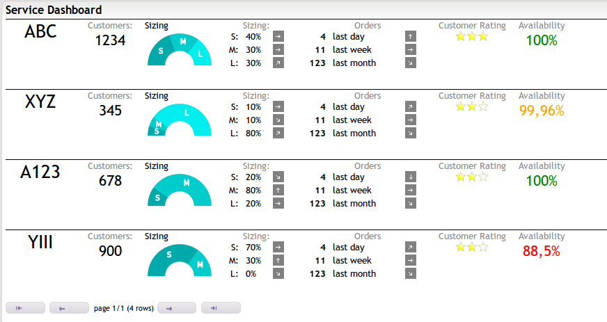

Lists use the table module, but render the cells as DIVS.
In addition it is possible to embed DIVs hierarchically.

 

Have a look at the [online demo](http://mh-svr.de/pong_dev/index.html?layout=tests/list)!